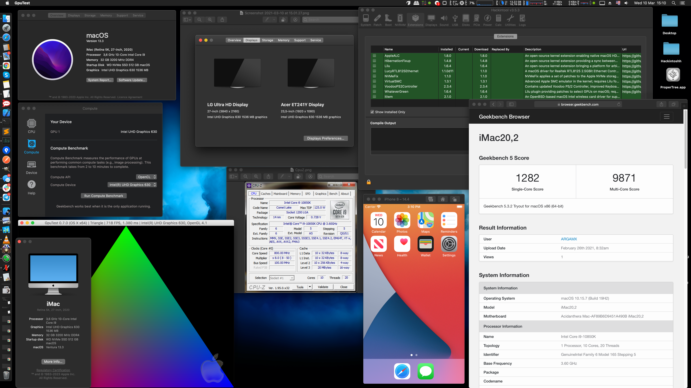

# Hackintosh-Intel-i9-10850k-MSI-Z490-GAMING-EDGE-WIFI



Hello folks,

I have successfully installed (updated) macOS to **Ventura 13.6** on my i9-10850k Comet Lake running on a MSI Z490 GAMING EDGE WIFI.

You can find my EFI folder in this repository.

# Version
- **OpenCore 0.9.5**

I think this config should perfectly work with the configuration based on:
- **LGA1200**
- **Comet Lake i3/i5/i7/i9 10xxx**
- **Z490 Chipset**
- **MSI GAMING**

Supports:
- **Ventura 13.x**

OpenCore setup was made according to
https://dortania.github.io/OpenCore-Install-Guide/

❗❗❗ **Go through that OpenCore-Install-Guide and generate your config.plist to get basic understanding.**

# Hardware

Component       | Details                                                       
---------------:|-------------------------------------------------------------- 
**Motherboard** | MSI Z490 GAMING EDGE WIFI
**CPU**         | Intel Core i9 10850K (Comet Lake)      
**iGPU**        | Intel UHD 630
**dGPU**        | None
**RAM**         | 2x Kingston DDR4 16Gb 3200MHz pc-25600 [KVR32N22S8/16]
**MB Audio**    | Realtek ALC1200-VD1
**MB Ethernet** | 2.5Gbit Realtek RTL8125B-CG
**MB Wi-Fi**    | Intel Wi-Fi 6 AX201 (a/b/g/n/ac/ax) (unsupported atm)
**Storage**     | WD SN750 NVMe 500GB Black [WDS500G3X0C]
**Display 1**   | DisplayPort 3840x2160 Monitor
**Display 2**   | HDMI 1920x1080 Monitor

# Working
- ✅ **Boot successfully** in macOS Catalina 10.15.7, BigSur 11.6, Monterey 12.6, Ventura 13.6
- ✅ **USB**
- ✅ **PS/2 Keyboard**
- ✅ **1x DisplayPort** for Output with 4k Monitor
- ✅ **1x HDMI** for Output with FullHD Monitor
- ✅ **Audio output**: ALC1200-VD1 (AppleALC.kext, layout-id=11)
- ✅ **Audio input**: via USB WebCamera
- ✅ **1Gbit Ethernet** (Realtek RTL8125B-CG)
- ✅ **OpenGL, OpenCL, Metal**
- ✅ **iOS Simulator**
- ✅ **Shutdown**
- ✅ **Restart**
- ✅ **Hibernate/Sleep/Wake**

# Not working so far
- [ ] Built-in WiFi was working on BigSur but after update to Monterey stop working.
- [ ] Built-in Bluetooth seems not working too.
- [ ] HDMI Monitor on weakup/turnon inits only after off/on.

# Problems solved
- [x] **Stuck on 'This version of Mac OS X is not supported'**: added flag ```-no_compat_check``` to ```boot-args```
- [x] **PS/2 Keyboard not working**: installed ```VoodooPS2Controller.kext``` https://github.com/acidanthera/VoodooPS2
- [x] **Ethernet not working**: installed ```LucyRTL8125Ethernet.kext``` https://www.insanelymac.com/forum/topic/343542-lucyrtl8125ethernetkext-for-realtek-rtl8125
- [x] **Audio not working**: installed ```AppleALC.kext``` and ```alcid``` (```layout-id```) set to ```11```
- [x] **Audio input mini-jack 3.5 mm**: via Microphone not working: installed ```VooDooHDA.kext```
- [x] **4k not available**: set ```framebuffer-stolenmem``` to ```00000002``` (was ```00003001```)
- [x] **HDMI monitor not working** after wake up: added flag ```igfxonln=1``` to ```boot-args```

- [x] **OpenCL not working**: set ```device-id``` to ```9B3E0000``` (was ```C59B0000```)
- [x] **OpenGL_GpuTest_OSX_x64_0.7.0 not working** (www.geeks3d.com/gputest): set ```device-id``` to ```9B3E0000``` (was ```C59B0000```)
- [x] **VLC not working - crashing**: set ```device-id``` to ```9B3E0000``` (was ```C59B0000```)
- [x] **iOS Simulator not working**: set ```device-id``` to ```9B3E0000``` (was ```C59B0000```)
- [x] **Firefox crashing on opening**: set ```device-id``` to ```9B3E0000``` (was ```C59B0000```)
- [x] **Safari can't open www.fb.com**: set ```device-id``` to ```9B3E0000``` (was ```C59B0000```)
- [x] **USB ports not working on BigSur and later**: 
use ```USBMap``` app:
https://github.com/corpnewt/USBMap

Read ```[GUIDE] HOW-TO: Properly Map Your USB Ports for OpenCore/Big Sur 11.4```:
https://hackintosher.com/forums/thread/guide-how-to-properly-map-your-usb-ports-for-opencore-big-sur-11-4.11426/

- [x] **HDMI monitor not working**: 

set 

(DisplayPort)

```framebuffer-con0-enable``` to ```01000000```

```framebuffer-con0-alldata``` to ```03040800 00040000 C7030000```

(HDMI)

```framebuffer-con1-enable``` to ```01000000```

```framebuffer-con1-alldata``` to ```01010900 00080000 C7030000```

(?)

```framebuffer-con2-enable``` to ```01000000```

```framebuffer-con2-alldata``` to ```02020A00 00080000 C7030000```
